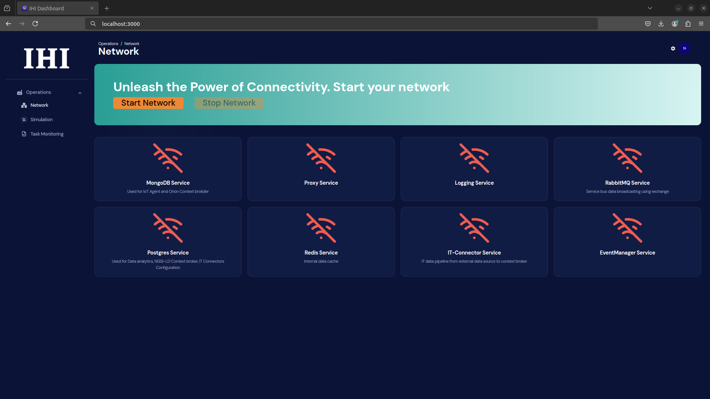

===================================
Installation - IOCS Dashboard
===================================

Link to the `rmf_dashboard <https://github.com/open-rmf-industrial/rmf2_dashboard>`_ repository:
::

   git clone git@github.com:open-rmf-industrial/rmf2_dashboard.git --branch ihi/dashboard

1) Installation by Source
==============================
Prerequisites
==============================
**Node.js**: Node.js: Ensure that you have Node.js installed on your machine. Choose the latest version of LTS (Long Term Support). You can download it from `Node.js official website. <https://nodejs.org/en/download>`_ 

**Verify Node.js Installation**:After installation, verify that Node.js is installed correctly by running the following command in your terminal:
::

   node -v

You should see the Node.js version, ideally v16.x or v18.x.

**Install pnpm**: After verifying Node.js, install pnpm globally using the following command:
::

   npm install -g pnpm

**Verify pnpm Installation**: Check if pnpm was installed successfully by running:
::

   pnpm -v

You should see the version of pnpm (e.g., v8.x.x).

==============================
Installing the IOCS Dashboard
==============================

**Clone the Repository**: Open your terminal and run the following command to clone the IOCS Dashboard repository:
::

  git clone git@github.com:open-rmf-industrial/rmf2_dashboard.git --branch ihi/dashboard

This command will download the repository to your local machine.

**Navigate to the Project Directory**: After cloning the repository, move into the project directory:
::

   cd IOCS Dashboard

**Install Dependencies**: Inside the project directory, run the following command to install all the required dependencies using pnpm:
::

   pnpm install

This will install all libraries and packages required to run IOCS Dashboard.

**Run the Project**: Once the dependencies are installed, start the server using:
::

   pnpm start

**Access the IOCS dashboard**: After the server starts, open your browser and go to:
::

   http://localhost:3000

You should see the IOCS dashboard running in your browser.

----------------------------

2) Installation by Containers
==============================
TODO
==============================
