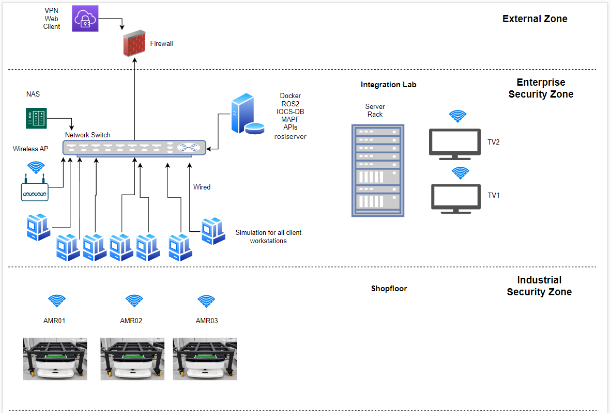
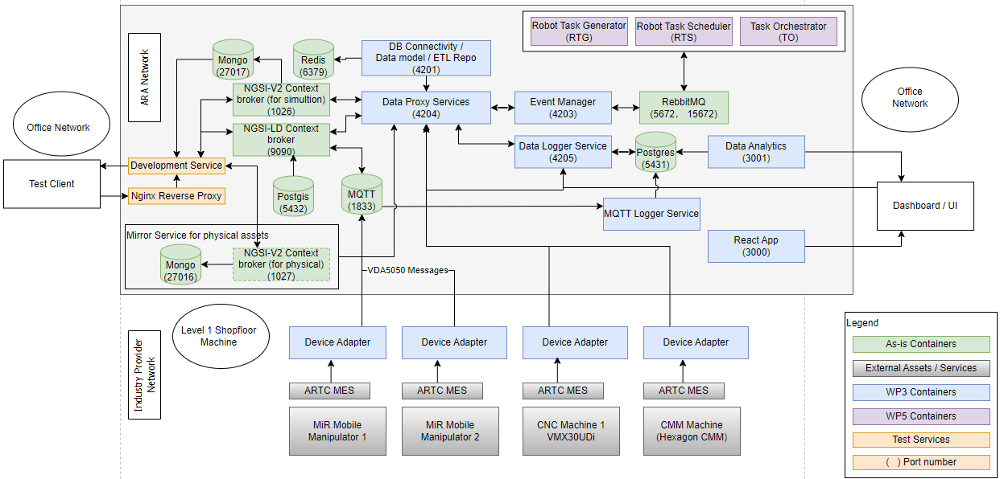

=====================================================
IT Architecture
=====================================================

This document outlines the design and architecture of the IHI ROS2 System [IR2S], a solution aimed at streamlining IT infrastructure management, 
enabling seamless data processing (including data transfer between IoT robot, servers etc..), to realize labor saving and efficiency improvement 
in distribution centers, warehouses, and factories. 

This document details the overall system architecture, components, and their interactions to provide a high-level understanding of the solution.

Network System Architecture
----------------------------

System Design Overview
----------------------------
The system was designed with a multi-layered cybersecurity approach to ensure robust protection for an organization's networks, applications, devices, and data.
    1. Network Layer Security
        ◦ Protects the organization's networks and communication channels.
        ◦ Ensures the secure transmission of data between devices and systems, preventing unauthorized interception or tampering.
    2. Application Security
        ◦ Safeguards business-critical software and applications from cyber threats.
        ◦ Implements regular updates, and patches to mitigate vulnerabilities.
    3. Endpoint Security
            ◦ Employs antivirus software, encryption, and device management policies to protect endpoints from malware and unauthorized access.
    4. Network Infrastructure Security
        ◦ Protects the foundational networking infrastructure.
        ◦ Installs preventative measures to prevent unauthorized access, modification, deletion, and theft of resources and data.
    5. Additional Layers of Cybersecurity
        ◦ Perimeter Security Layer: Employs firewalls, intrusion detection systems (IDS), and intrusion prevention systems (IPS) to safeguard the network's boundary.
        ◦ Data Security Layer: Protects sensitive data through encryption, secure storage, and data loss prevention (DLP) mechanisms.
        ◦ Mission-Critical Assets: Ensures the security and availability of key organizational assets vital to operations and success.

This layered architecture provides a comprehensive security framework, addressing vulnerabilities at every level and ensuring the organization's assets are well-protected against evolving cyber threats.
    1. Components
        ◦ Firewall, Network switch, Wireless AP, NAS, Servers, workstations and server rack. 
    2. Interconnectivity
        ◦ IoT devices are interconnected with servers over a secure network to ensure reliable communication while safeguarding data from unauthorized access and cyber threats. The following mechanisms are employed:  
        ◦ IT connectivity:  
        ◦ Secure Communication Protocols: IoT devices communicate with servers using encrypted protocols like HTTPS, MQTT with TLS, or CoAP over DTLS, ensuring data is securely transmitted.  
        ◦ Encryption prevents eavesdropping and tampering during data exchange.  
        ◦ Authentication and Authorization  
        ◦ Devices authenticate with the server using strong, unique credentials, such as digital certificates, pre-shared keys, or token-based authentication (e.g., OAuth).  
        ◦ Role-based access control (RBAC) ensures devices and users only access resources they are authorized to use.  
        ◦ Device Whitelisting  
        ◦ Only onboarded and registered IoT devices are allowed to connect to the network.  
        ◦ Network Segmentation  
        ◦ IoT devices are isolated in a dedicated network segment or VLAN, reducing exposure to other parts of the network.  
        ◦ Firewalls enforce strict traffic rules, allowing communication only between IoT devices and designated servers.  
        ◦ Data transmitted from IoT devices is verified for integrity using checksums or cryptographic signatures, ensuring it hasn't been altered during transit.  
        ◦ Endpoint Security Measures  
        ◦ IoT devices are equipped with built-in security features, such as secure boot, hardware encryption modules, and firmware updates signed by the manufacturer.  
        ◦ Continuous Monitoring and Logging  
        ◦ Traffic between IoT devices and servers is continuously monitored for anomalies or potential threats using intrusion detection and prevention systems (IDS/IPS).  
        ◦ Logs of all activities are maintained for auditing and incident analysis.  
        ◦ Firewall and Access Policies  
        ◦ Firewalls at the network edge enforce policies to allow only essential communication between IoT devices and the server.  
        ◦ Open ports are minimized to reduce the attack surface.  
    3. Diagram (Optional)  
        ◦ Include a visual representation of the system architecture (e.g., block diagram or flowchart).  

