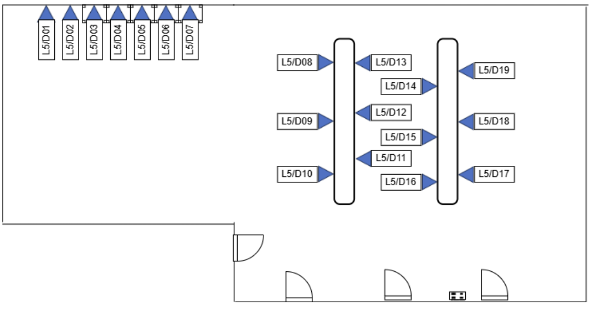

=====================================================
Integration Lab Network Architecture
=====================================================

New physical Server rack, network wall points, network switches, wireless AP, NAS, Servers and workstations are being setup and implemented in the lab.

Physical network wall point has been installed in the integration lab as show below for future network expansion.

